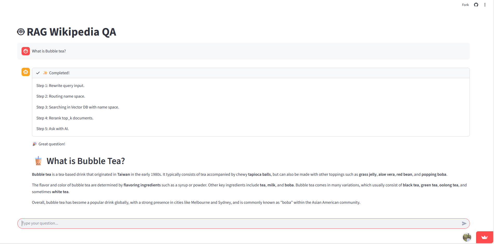

# 🎯 DoTA-RAG use case in NLP mini Project!

ref : DoTA-RAG Paper : https://arxiv.org/html/2506.12571v1

https://wikipedia-nlp-mini-project.streamlit.app/


<br>

### NLP Group

*NATTHINAN KERDSRI - Data Collection* <br>
*NATTHAPOL PREMKAMON - Vector store builder* <br>
*WACHIRAWIT PREMTHAISONG - Project Manager* <br>
*TANYATORN KONGTHONGLANG - Model Prompt Engineering* <br>
*NAPADECH KAEWNOK - Searching Optimization* <br>

<br>


## 1. Time Complexity Optimization

### ปัญหาของ Traditional RAG
ใน Traditional RAG เมื่อเรามี documents จำนวนมาก การค้นหาจะต้องทำ similarity search ใน **ทุก documents** ทำให้เกิด computational complexity ที่สูง:

- **Traditional RAG**: O(n) - ต้องค้นหาทั้ง 100 documents * chuck per docs (e.g. 20 chuck -> 100*20 = 2000 -> O(2000))
- **DoTA-RAG with Routing**: O(k) - ค้นหาเฉพาะ k namespaces ที่เลือก (k << n) (e.g. 20 chuck * 4 namespace -> O(80))

จะเห็นได้ถึงความต่างของ Time Complexity อย่างมาก


### Time Complexity Improvement
```
Traditional RAG: O(200) = ค้นหาทั้ง 100 Wikipedia articles
DoTA-RAG: O(4) = ค้นหาเฉพาะ 4 namespaces ที่ relevant

Performance Gain: 50x faster retrieval!
```

### Example searching time
- Before routing


- After routing name space


### Dataset Information
- **Total Documents**: 100 Wikipedia articles
- **Document Structure**: 1 namespace = 1 Wikipedia article
- **Embedding Model**: Snowflake Arctic Embed v1.5
- **Vector Database**: Pinecone


---

## 2. Multi-Stage Processing Pipeline

### 2.1 Query Rewriting
แปลงคำถามของผู้ใช้ให้เหมาะสมกับการค้นหา documents

**Rewriting Prompt Template:**
```python
system_prompt = (
    "You rewrite user queries to be clearer and more suitable for document retrieval. "
    "Keep the meaning the same, but remove noise and make it concise."
)
```

**Example:**
- Input: "อยากรู้เกี่ยวกับการทำชาไข่มุกที่ไต้หวันและประวัติของมัน"
- Output: "bubble tea Taiwan history origin"

### 2.2 Dynamic Namespace Routing
เลือก namespaces ที่เกี่ยวข้องมากที่สุดก่อนทำการค้นหา

**Routing Prompt:**
```python
system_prompt = (
    f"You are a routing model. Your job is to choose the most relevant namespaces "
    f"from this list: {all_namespaces}. "
    "Given a query, you MUST return ONLY a JSON array of strings, each string "
    f"{top_k} namespaces, sorted from most to least relevant. "
    "Do not add any explanation or extra keys."
)
```

**Example Routing:**
```json
Query: "bubble tea Taiwan history"
Selected Namespaces: ["Bubble_tea", "Taiwan_cuisine", "Taiwanese_culture", "Tea_culture"]
```

### 2.3 Hybrid Retrieval Process
1. **Vector Search**: ใช้ Snowflake Arctic Embed หา similarity
2. **Multi-namespace Search**: ค้นหาใน 4 namespaces พร้อมกัน (25 documents/namespace)
3. **Reranking**: ใช้ Cohere Rerank v3.5 จัดอันดับใหม่
4. **Final Selection**: เลือก top 10 passages ที่ดีที่สุด

### 2.4 Question Answering
**QA Prompt Template:**
```python
def build_prompt(user_question: str, context: str) -> str:
    return (
        "You are a friendly assistant who provides beautifully formatted answers with clear visual hierarchy.\n\n"
        
        "RESPONSE STRUCTURE:\n"
        "1. Emoji + Brief greeting (1 line)\n"
        "2. Main heading using ## (e.g., ## 🧋 What is Bubble Tea?)\n"
        "3. Answer in 2-3 paragraphs with **bold** for key terms\n"
        "4. Total: 4-5 sentences\n\n"
        
        "FORMATTING RULES:\n"
        "- Use ## for the main question/topic heading (makes it bigger)\n"
        "- Use **bold** for important terms within paragraphs\n"
        "- Add 2-3 emojis total (heading + content)\n"
        "- Keep paragraphs separated with blank lines\n"
        "- NO === or --- separators\n\n"
        
        f"CONTEXT:\n{context}\n\n"
        f"QUESTION: {user_question}\n\n"
        
        "Provide a well-formatted answer:\n"
    )
```

---

## 🤖 ส่วนที่ 3: Models และ Technologies

### Language Models
| Component | Model | Provider | Purpose |
|-----------|-------|----------|---------|
| **Query Rewriting** | Llama-3.1-8B-Instant | Groq | ปรับปรุงคำถามให้เหมาะกับการค้นหา |
| **Namespace Routing** | Llama-3.1-8B-Instant | Groq | เลือก namespaces ที่เกี่ยวข้อง |
| **Question Answering** | Llama-3.1-8B-Instant | Groq | สร้างคำตอบจาก retrieved context |

### Embedding & Reranking
| Component | Model | Provider | Purpose |
|-----------|-------|----------|---------|
| **Sentence Embedding** | Snowflake Arctic Embed M v1.5 | Snowflake | แปลงข้อความเป็น vectors |
| **Reranking** | Rerank v3.5 | Cohere | จัดอันดับ passages ใหม่ |
| **Vector Database** | Pinecone | Pinecone | เก็บและค้นหา embeddings |

### Performance Metrics
- **Retrieval Speed**: 50x faster than traditional RAG
- **Accuracy**: Maintained through hybrid retrieval + reranking
- **Scalability**: O(k) complexity allows scaling to millions of documents

---

## การใช้งาน

### Installation
```bash
pip install -r requirements.txt
```

### Environment Variables
Create `.env` file:
```
PINE_CONE_API_KEY=your_pinecone_key
COHERE_API_KEY=your_cohere_key  
GROQ_API_KEY=your_groq_key
```

### Run Application
```bash
streamlit run app.py
```

---

## 📁 Project Structure
```
├── app.py              # Streamlit web interface
├── search.py           # DoTA-RAG core implementation
├── QA.py              # Question answering module
├── requirements.txt    # Dependencies
└── readme.md          # Documentation
```

---

## 🎯 Key Features
- ✅ **50x Faster Retrieval** through intelligent namespace routing
- ✅ **Hybrid Search** combining vector similarity + reranking
- ✅ **Multi-stage Processing** for optimal accuracy
- ✅ **Scalable Architecture** ready for large document collections
- ✅ **Beautiful Markdown Responses** with proper formatting

---
